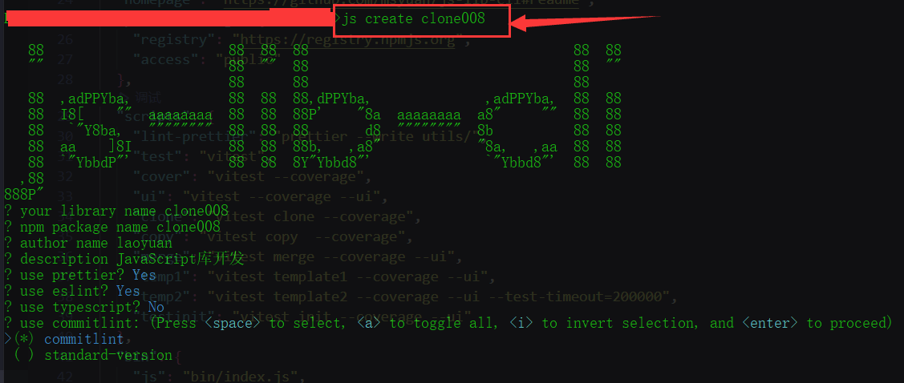

# JS Lib CLI 创建JS库项目的CLI工具

一个方便快速创建JavaScript开发库项目的CLI工具

## 一、使用者指南

### 1、通过pnpm等下载全局安装

```bash
pnpm install -g js-lib-cli ||  npm install -g js-lib-cli
```

### 2、如何初始化一个JS开发库项目

#### 2.1、运行以下命令来创建一个新项目（mylib）

```js
js create mylib
```

#### 2.2、你会被提示选取一个preset



### 3、自主安装依赖

```js
git init
pnpm install
```
1. 如果选择了husky，则需先初始化git仓库, 然后再安装依赖。
2. 如果在提示选取阶段选择了package manager为pnpm\yarn\npm, 则会自动git init，然后自动安装依赖。

### 4、可选项帮助命令

```js
js --help
```

## 二、参与贡献

1.  Fork 本仓库
2.  新建 Feat-xxx 分支
3.  提交代码
4.  新建 Pull Request